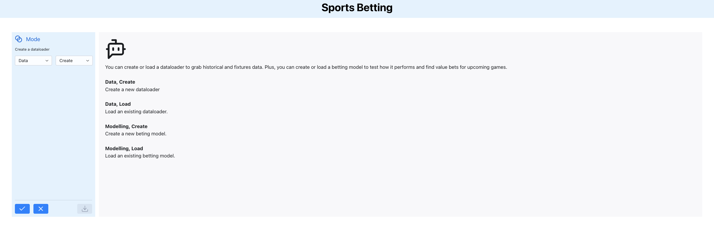
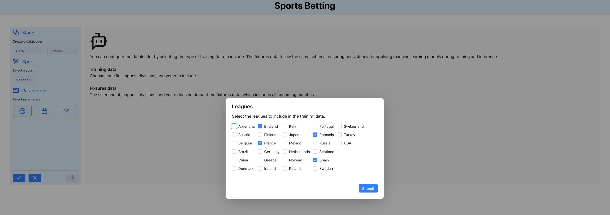
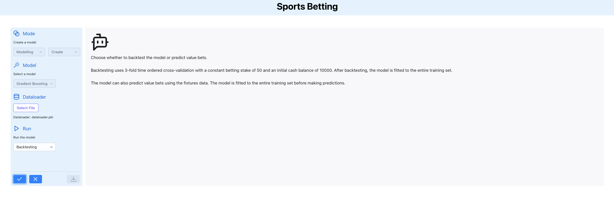

[scikit-learn]: <http://scikit-learn.org/stable/>
[black badge]: <https://img.shields.io/badge/%20style-black-000000.svg>
[black]: <https://github.com/psf/black>
[docformatter badge]: <https://img.shields.io/badge/%20formatter-docformatter-fedcba.svg>
[docformatter]: <https://github.com/PyCQA/docformatter>
[ruff badge]: <https://img.shields.io/endpoint?url=https://raw.githubusercontent.com/charliermarsh/ruff/main/assets/badge/v1.json>
[ruff]: <https://github.com/charliermarsh/ruff>
[mypy badge]: <http://www.mypy-lang.org/static/mypy_badge.svg>
[mypy]: <http://mypy-lang.org>
[mkdocs badge]: <https://img.shields.io/badge/docs-mkdocs%20material-blue.svg?style=flat>
[mkdocs]: <https://squidfunk.github.io/mkdocs-material>
[version badge]: <https://img.shields.io/pypi/v/sports-betting.svg>
[pythonversion badge]: <https://img.shields.io/pypi/pyversions/sports-betting.svg>
[downloads badge]: <https://img.shields.io/pypi/dd/sports-betting>
[gitter]: <https://gitter.im/sports-betting/community>
[gitter badge]: <https://badges.gitter.im/join%20chat.svg>
[discussions]: <https://github.com/georgedouzas/sports-betting/discussions>
[discussions badge]: <https://img.shields.io/github/discussions/georgedouzas/sports-betting>
[ci]: <https://github.com/georgedouzas/sports-betting/actions?query=workflow>
[ci badge]: <https://github.com/georgedouzas/sports-betting/actions/workflows/ci.yml/badge.svg?branch=main>
[doc]: <https://github.com/georgedouzas/sports-betting/actions?query=workflow>
[doc badge]: <https://github.com/georgedouzas/sports-betting/actions/workflows/doc.yml/badge.svg?branch=main>

# sports-betting

[![ci][ci badge]][ci] [![doc][doc badge]][doc]

| Category          | Tools    |
| ------------------| -------- |
| **Development**   | [![black][black badge]][black] [![ruff][ruff badge]][ruff] [![mypy][mypy badge]][mypy] [![docformatter][docformatter badge]][docformatter] |
| **Package**       | ![version][version badge] ![pythonversion][pythonversion badge] ![downloads][downloads badge] |
| **Documentation** | [![mkdocs][mkdocs badge]][mkdocs]|
| **Communication** | [![gitter][gitter badge]][gitter] [![discussions][discussions badge]][discussions] |

## Introduction

The `sports-betting package` is a handy set of tools for creating, testing, and using sports betting models. It comes
with a Python API, a CLI, and even a GUI built with [Reflex](https://reflex.dev/) to keep things simple:


The main components of `sports-betting` are dataloaders and bettors objects:

- Dataloaders download and prepare data suitable for predictive modelling.
- Bettors provide an easy way to backtest betting strategies and predict the value bets of future events.

## Quick start

### GUI

`sports-betting` comes with a GUI that provides a intuitive way to interact with the library. It supports the following
functionalitites:

- Easily upload, create, or update dataloaders to handle historical and fixtures data.
- Develop and test betting models with tools for backtesting and identifying value bets.

To launch the GUI, simply run the command `sportsbet-gui`. Once started, you’ll see the initial screen:




Explore the functionality with guidance from the built-in bot, which streams helpful messages along the way.

### API

The `sports-betting` package makes it easy to download sports betting data:

```python
from sportsbet.datasets import SoccerDataLoader
dataloader = SoccerDataLoader(param_grid={'league': ['Italy'], 'year': [2020]})
X_train, Y_train, O_train = dataloader.extract_train_data(odds_type='market_maximum')
X_fix, Y_fix, O_fix = dataloader.extract_fixtures_data()
```

`X_train` are the historical/training data and `X_fix` are the test/fixtures data. The historical data can be used to backtest the
performance of a bettor model:

```python
from sportsbet.evaluation import ClassifierBettor, backtest
from sklearn.dummy import DummyClassifier
bettor = ClassifierBettor(DummyClassifier())
backtest(bettor, X_train, Y_train, O_train)
```

We can use the trained bettor model to predict the value bets using the fixtures data:

```python
bettor.fit(X_train, Y_train)
bettor.bet(X_fix, O_fix)
```

## Sports betting in practice

You can think of any sports betting event as a random experiment with unknown probabilities for the various outcomes. Even for the
most unlikely outcome, for example scoring more than 10 goals in a soccer match, a small probability is still assigned. The
bookmaker estimates this probability P and offers the corresponding odds O. In theory, if the bookmaker offers the so-called fair
odds O = 1 / P in the long run, neither the bettor nor the bookmaker would make any money.

The bookmaker's strategy is to adjust the odds in their favor using the over-round of probabilities. In practice, it offers odds
less than the estimated fair odds. The important point here is that the bookmaker still has to estimate the probabilities of
outcomes and provide odds that guarantee them long-term profit.

On the other hand, the bettor can also estimate the probabilities and compare them to the odds the bookmaker offers. If the
estimated probability of an outcome is higher than the implied probability from the provided odds, then the bet is called a value
bet.

The only long-term betting strategy that makes sense is to select value bets. However, you have to remember that neither the
bettor nor the bookmaker can access the actual probabilities of outcomes. Therefore, identifying a value bet from the side of the
bettor is still an estimation. The bettor or the bookmaker might be wrong, or both of them.

Another essential point is that bookmakers can access resources that the typical bettor is rare to access. For instance, they have
more data, computational power, and teams of experts working on predictive models. You may assume that trying to beat them is
pointless, but this is not necessarily correct. The bookmakers have multiple factors to consider when they offer their adjusted
odds. This is the reason there is a considerable variation among the offered odds. The bettor should aim to systematically
estimate the value bets, backtest their performance, and not create arbitrarily accurate predictive models. This is a realistic
goal, and `sports-betting` can help by providing appropriate tools.

## Installation

For user installation, `sports-betting` is currently available on the PyPi's repository, and you can install it via `pip`:

```bash
pip install sports-betting
```

If you have Node.js version v22.0.0 or higher, you can optionally install the GUI:

```bash
pip install sports-betting[gui]
```

Development installation requires to clone the repository and then use [PDM](https://github.com/pdm-project/pdm) to install the
project as well as the main and development dependencies:

```bash
git clone https://github.com/georgedouzas/sports-betting.git
cd sports-betting
pdm install
```

## Usage

You can access `sports-betting` through the GUI application, the Python API, or the CLI. However, it’s a good idea to
get familiar with the Python API since you’ll need it to create configuration files for the CLI or load custom betting
models into the GUI. `sports-betting` supports all common sports betting needs i.e. fetching historical and fixtures
data as well as backtesting of betting strategies and prediction of value bets. 

## GUI

Launch the GUI app with the command `sportsbet-gui`.

Here are a few things you can do with the GUI:

- Configure the dataloader:




- Create a new betting model:




- Run the model to get either backtesting results or value bets:


### API

Assume we would like to backtest the following scenario and use the bettor object
to predict value bets:

- Selection of data
  - First and second division of German, Italian and French leagues for the years 2021-2024
  - Maximum odds of the market in order to backtest our betting strategy
- Configuration of betting strategy
  - 5-fold time ordered cross-validation
  - Initial cash of 10000 euros
  - Stake of 50 euros for each bet
  - Use match odds (home win, away win and draw) as betting markets
  - Logistic regression classifier to predict probabilities and value bets

```python
# Selection of data
from sportsbet.datasets import SoccerDataLoader

leagues = ['Germany', 'Italy', 'France']
divisions = [1, 2]
years = [2021, 2022, 2023, 2024]
odds_type = 'market_maximum'
dataloader = SoccerDataLoader({'league': leagues, 'year': years, 'division': divisions})
X_train, Y_train, O_train = dataloader.extract_train_data(odds_type=odds_type)
X_fix, _, O_fix = dataloader.extract_fixtures_data()

# Configuration of betting strategy
from sklearn.model_selection import TimeSeriesSplit
from sklearn.compose import make_column_transformer
from sklearn.linear_model import LogisticRegression
from sklearn.impute import SimpleImputer
from sklearn.pipeline import make_pipeline
from sklearn.preprocessing import OneHotEncoder
from sklearn.multioutput import MultiOutputClassifier
from sportsbet.evaluation import ClassifierBettor, backtest

tscv = TimeSeriesSplit(5)
init_cash = 10000.0
stake = 50.0
betting_markets = ['home_win__full_time_goals', 'draw__full_time_goals', 'away_win__full_time_goals']
classifier = make_pipeline(
  make_column_transformer(
    (OneHotEncoder(handle_unknown='ignore'), ['league', 'home_team', 'away_team']), remainder='passthrough'
  ),
  SimpleImputer(),
  MultiOutputClassifier(LogisticRegression(solver='liblinear', random_state=7, class_weight='balanced', C=50)),
)
bettor = ClassifierBettor(classifier, betting_markets=betting_markets, stake=stake, init_cash=init_cash)

# Apply backtesting and get results
backtesting_results = backtest(bettor, X_train, Y_train, O_train, cv=tscv)

# Get value bets for upcoming betting events
bettor.fit(X_train, Y_train)
bettor.bet(X_fix, O_fix)
```

### CLI

The command `sportsbet` provides various sub-commands to download data and predict the value bets. For any sub-command you may
add the `--help` flag to get more information about its usage.

#### Configuration

In order to use the commands, a configuration file is required. You can find examples of such configuration files in
`sports-betting/configs/`. The configuration file should have a Python file extension and contain a few variables. The variables 
`DATALOADER_CLASS` and `PARAM_GRID` are mandatory while the rest are optional.

The following variables configure the data extraction:

- `DATALOADER_CLASS`: The dataloader class to use.

- `PARAM_GRID`: The parameters grid to select the type of information that the data includes.

- `DROP_NA_THRES`: The parameter `drop_na_thres` of the dataloader's `extract_train_data`.

- `ODDS_TYPE`: The parameter `odds_type` of the dataloader's `extract_train_data`.

The following variables configure the betting process:

- `BETTOR`: A bettor object.

- `CV`: The parameter `cv` of the function `backtest`.

- `N_JOBS`: The parameter `n_jobs` of the function `backtest`.

- `VERBOSE`: The parameter `verbose` of the function `backtest`.

#### Commands

Once these variables are provided, we can select the appropriate commands to select any of the `sports-betting`'s functionalities.

##### Dataloader

Show available parameters for dataloaders:

```bash
sportsbet dataloader params -c config.py
```

Show available odds types:

```bash
sportsbet dataloader odds-types -c config.py
```

Extract training data and save them as CSV files:

```bash
sportsbet dataloader training -c config.py -d /path/to/directory
```

Extract fixtures data and save them as CSV files:

```bash
sportsbet dataloader fixtures -c config.py -d /path/to/directory
```

##### Bettor

Backtest the bettor and save the results as CSV file:

```bash
sportsbet bettor backtest -c config.py -d /path/to/directory
```

Get the value bets and save them as CSV file:

```bash
sportsbet bettor bet -c config.py -d /path/to/directory
```
